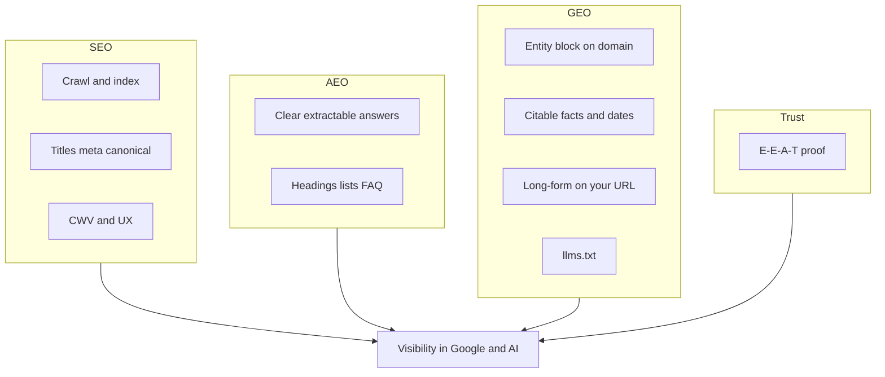
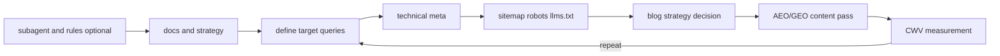

# SEO + AEO + GEO roadmap for vijayjangir.com

**Status:** This document is the versioned strategy and roadmap. Technical implementation items below are tracked as future work unless noted otherwise.

**Related:** [seo-audit-log.md](./seo-audit-log.md) (dated audits), [authority-index.md](./authority-index.md) (sources of truth).

---

## Non-goals and decision boundaries

### Non-goals

- Do **not** replace Wix as the current blog authoring source of truth under this roadmap.
- Do **not** add paid infrastructure, always-on services, or speculative platform work.
- Do **not** expand this roadmap into private `/admin`, `/assistant`, or non-public product surfaces unless explicitly requested.
- Do **not** add misleading schema, fake freshness signals, or unverifiable claims just to chase rankings.
- Do **not** add analytics vendors or SEO SaaS tooling beyond Search Console and lightweight manual checks unless explicitly approved.

### Decision boundaries

- Safe to decide without extra approval:
  - metadata improvements
  - canonical host cleanup
  - default social preview image wiring
  - favicon/app-icon head links
  - `robots.txt`
  - `llms.txt`
  - `Person` JSON-LD with public `sameAs` links
  - internal linking and copy-hierarchy improvements
- Safe to decide **if keeping Wix as CMS**:
  - local `/blog/[slug]` rendering on `vijayjangir.com`
  - cached fetch/revalidation behavior
  - graceful fallback states when Wix data or credentials are missing
- Requires explicit approval:
  - replacing Wix
  - adding paid tools or new infrastructure
  - publishing private location or employer details not already intended for the public site
  - adding new dependencies when an Astro- or platform-native option is sufficient

---

## Target queries (fill in manually)

Use [Google Search Console](https://search.google.com/search-console) and keyword tools. Record 5–15 target queries and baseline positions here when ready.

| Query                     | Intent  | Baseline (date) | Notes |
| ------------------------- | ------- | --------------- | ----- |
| _(example: Vijay Jangir)_ | Branded |                 |       |
|                           |         |                 |       |

**Execution gate:** do not judge ranking progress or claim SEO wins until at least 5 target queries and baseline dates are recorded here.

---

## What “top ranker” actually means

Search rankings are **query-specific**. For a personal site, realistic goals look like this:

- **Rank for your name** (“Vijay Jangir”) — Usually achievable. Consistent entity signals, indexed homepage, LinkedIn/GitHub, a few backlinks.
- **Rank for branded + role** (“Vijay Jangir data engineer”) — Moderate. Strong on-page focus, crawlable content, experience keywords.
- **Rank for generic head terms** (“data engineer”, “Kafka tutorial”) — Very hard. Original long-form content, backlinks, topical authority, time.

No honest plan can promise “#1 everywhere.” The right approach is: **pick 5–15 target queries**, measure baseline positions in Search Console, then improve technical SEO + content + links for those intents.

---

## Modern stack: SEO, AEO, GEO, and adjacent signals

Treat these as **layers** you work on over time (aligned with periodic work).

### SEO (classic search)

Crawlability, indexation, relevance, links, Core Web Vitals — Phases 1–5 below remain the foundation.

### AEO — Answer engine optimization

Optimizing for **direct answers**: featured snippets, “People also ask,” voice assistants, and any surface that extracts a short answer.

- **Clear, extractable answers**: One tight paragraph per section that could stand alone as an answer; use logical `h1`–`h3` hierarchy.
- **FAQ / HowTo schema** only where content genuinely matches (avoid empty or misleading schema).
- **Question-shaped headings** where natural (“What I focus on”, “How to reach me”) without keyword stuffing.
- **Tables and lists** for scannable facts (skills, highlights) — helps humans and extractors.

### GEO — Generative engine optimization

Optimizing for **AI assistants and AI summaries** (ChatGPT, Perplexity, Gemini, Copilot, Google AI Overviews) that **summarize and cite** sources.

- **Primary domain as the citeable source**: Facts, bio, and career narrative should live in **clear HTML on vijayjangir.com** so models and crawlers attribute you correctly.
- **Quotable “entity block”**: Name, role, location (if public), one-line specialty, 2–3 proof points — consistent across site, LinkedIn, GitHub readme.
- **Attribution-friendly writing**: Specific employers, project names, dates, and outcomes (not vague “various clients”).
- **Freshness**: Visible “last updated” in footer — keep it honest when content changes.
- **`llms.txt`**: Machine-readable site summary in `public/llms.txt` for LLM crawlers. Include who you are, what the site covers, key URLs, and a short bio. Emerging convention — low cost to add, high GEO alignment.
- **Wix split**: Outbound-only blog means **long-form authority accrues to Wix**, not your domain — GEO and blog SEO both improve when full posts render on your domain (see product decision below).

**Related terms (same bucket):** **LLMO** (LLM optimization), **AI Overviews** / **SGE**-style surfaces — same tactics: clarity, specificity, trustworthy citations on your site.

### E-E-A-T (not a separate acronym, but required)

For a **personal brand** site: **Experience, Expertise, Authoritativeness, Trust** — show real projects, links, speaking, employers; avoid unverifiable superlatives.

### Other high-signal items to include over time

- **Video** (YouTube with transcripts) if you do talks — embeds and links back to the site.
- **Podcast / interview** show notes linking to your domain.
- **Open-source** repos with readmes that link to your site.
- **International / language**: if you ever add locales, use `hreflang` correctly (not needed for English-only today).

---

## Execution order (when implementing)

Infrastructure and docs first, then code, then content, then measurement.

### Dependency order and validation gates

1. **Lock scope first** — keep the non-goals and decision boundaries above intact; choose one canonical host (WWW vs apex).
2. **Define measurement first** — record target queries and baseline dates in Search Console before ranking work.
3. **Ship technical crawl/index basics** — metadata, social preview, crawler files, structured data, favicon links.
4. **Ship content and internal-link pass** — sharpen positioning, add extractable answers, strengthen route-to-route linking.
5. **Ship blog architecture decision** — keep `/blog` stable, then add local detail pages with Wix as CMS/source of truth.
6. **Validate and iterate** — run build/lint/test, then review Search Console + audit log on a 4–8 week cadence.

---

## Phase 1: Technical foundation (this repo)

**Already in place** (`src/layouts/BaseLayout.astro`, `astro.config.mjs`, selected route files):

- `site: "https://www.vijayjangir.com"` for absolute URLs
- Per-page `title` and `description` on routes like `src/pages/blog/index.astro`, `src/pages/resume.astro`, `src/pages/projects.astro`
- `og:title`, `og:description`, `og:url`, `og:type`, `twitter:card`, and `rel="canonical"`

**Gaps to close (high impact, low risk):**

1. **Social preview images** — `twitter:card` = `summary_large_image` but **no `og:image` / `twitter:image`**. Add default 1200×630 in `public/`; optional per-route overrides.
2. **XML sitemap** — Generate a sitemap with an Astro-native route or another low-dependency approach first; if a package is still the best option, record that dependency choice explicitly before adding it. Exclude `/admin`, `/assistant`, `/api`.
3. **`robots.txt`** — Allow important paths; sitemap reference; **disallow** `/admin`, `/assistant`, `/api`.
4. **`llms.txt`** — Machine-readable site summary in `public/llms.txt` for LLM crawlers. Emerging GEO convention.
5. **Structured data** — JSON-LD [Person](https://schema.org/Person) with `sameAs` for GitHub/LinkedIn (strong GEO + SEO entity signal).
6. **Favicon / app icons** — `public/favico.ico` / `public/favico.png` already exist; wire them into the shared head via `link rel="icon"` and optional `apple-touch-icon`.
7. **Homepage metadata** — `src/pages/index.astro`: homepage-specific **title** and **description** for one clear positioning line.
8. **WWW vs apex** — One canonical host in Vercel + Search Console.

---

## Phase 2: On-page content and intent

- **One primary headline** and supporting proof; see [site-review.md](./site-review.md).
- **Unique copy** per route; avoid thin duplicates.
- **Internal linking** — Deliberate cross-links between `/`, `/resume`, `/work`, and `/blog`. Distributes page authority and helps crawlers discover content.
- **Blog strategy** — Full posts on your domain for SEO + GEO; [AGENTS.md](../AGENTS.md) aligns with Wix-as-CMS + local routes when ready.

### Product decision: blog (record when decided)

| Option                                               | SEO/GEO impact                        |
| ---------------------------------------------------- | ------------------------------------- |
| Wix-only outbound links                              | Long-form ranking power stays on Wix  |
| Local `/blog/[slug]` on vijayjangir.com (Wix as CMS) | Stronger domain authority for writing |

**Decision:** Use **local `/blog/[slug]` pages on vijayjangir.com while keeping Wix as the authoring source of truth**.

**Reasoning:** This matches the repo direction: keep Wix as CMS, keep the current index page stable, then move full-post rendering onto the primary domain so SEO and GEO value accrue to `vijayjangir.com`.

**Implementation constraint:** local post routes must degrade cleanly when Wix data or credentials are missing, and should not introduce paid infrastructure.

---

## Phase 3: Performance and UX

- Measure **LCP** on homepage (`HomePage` with `client:load`); tune if needed.
- Lighthouse / [PageSpeed Insights](https://pagespeed.web.dev/).
- Meaningful **alt** text on images.

---

## Phase 4: Off-site authority and entity consistency

- LinkedIn, GitHub, talks, guest posts — **same name spelling** and link back to the site.
- Natural backlinks; avoid paid link schemes.

---

## Phase 5: Measure and iterate

- Search Console: sitemap, Performance, Coverage, CWV.
- Every **4–8 weeks**: review queries, CTR, and AEO/GEO opportunities (what questions appear in GSC?).
- Record findings in [seo-audit-log.md](./seo-audit-log.md).

---

## Success criteria and exit gates

### Roadmap readiness gate

- Non-goals and decision boundaries are explicit and unchanged.
- A canonical host decision exists.
- The target-query table has at least 5 rows with baseline dates.
- The blog product decision is recorded.

### Phase 1 exit criteria

- Homepage `title` and `description` clearly position Vijay in one line.
- Default social preview image is linked in shared metadata.
- `robots.txt`, `llms.txt`, and sitemap output exist and match the intended crawl policy.
- Public `Person` JSON-LD with `sameAs` links is emitted.
- Favicon/app-icon links are wired in the shared layout.

### Phase 2 exit criteria

- Homepage and key route copy use one clear primary positioning statement plus supporting proof.
- Important public routes link meaningfully to each other.
- Blog detail pages render on `vijayjangir.com` while Wix remains the source of truth, or the deferral is explicitly recorded with rationale.
- Any FAQ/HowTo schema used is backed by real on-page content.

### Phase 3 exit criteria

- Homepage LCP has been measured and obvious regressions are addressed.
- Core images have meaningful alt text.
- UX changes do not weaken clarity or trust.

### Phase 5 operating cadence

- Search Console is configured and checked after sitemap changes.
- `docs/seo-audit-log.md` records findings at least every 4–8 weeks while active work continues.
- Ranking claims are tied to the target-query table, not generic “top ranker” language.

---

## Optional: isolated SEO audit agent (Cursor)

Future work (not required for the site to ship improvements):

- **Rule:** `.cursor/rules/seo-aeo-geo-audit.mdc` — when to apply, boundaries.
- **Skill:** `.cursor/skills/seo-aeo-geo-audit/SKILL.md` — cadence, checklist, where to log results.

**Behavior contract:** In scope — read site-facing files, update `docs/seo-audit-log.md` and this strategy doc with findings; list code suggestions as text in the audit log. Out of scope by default — editing `src/`, `lib/`, `astro.config.mjs`, unless explicitly requested.

**Audit checklist categories:**

1. **Technical SEO** — titles, descriptions, canonical, OG tags, favicon, sitemap presence, robots.txt, structured data, `lang` attribute, heading hierarchy.
2. **AEO readiness** — extractable answer paragraphs, question-shaped headings, list/table markup, FAQ/HowTo schema where appropriate.
3. **GEO readiness** — entity block clarity, `sameAs` in JSON-LD, llms.txt presence and accuracy, citable facts, freshness signal.
4. **E-E-A-T signals** — verifiable claims, external proof links (GitHub, LinkedIn), author identity consistency.
5. **Performance** — LCP/CLS/FID from Lighthouse or PSI; flag regressions.
6. **Content** — thin/duplicate pages, internal linking gaps, keyword alignment with target queries above.

---

## Summary

| Horizon     | Focus                                                                                                             |
| ----------- | ----------------------------------------------------------------------------------------------------------------- |
| **Short**   | Technical SEO gaps (OG images, sitemap, robots, llms.txt, Person JSON-LD, homepage meta, GSC).                    |
| **Medium**  | On-domain blog if writing-driven SEO/GEO matters; AEO-friendly copy; entity consistency; internal linking.        |
| **Ongoing** | [seo-audit-log.md](./seo-audit-log.md) + periodic audits; revisit GEO/AEO checklist yearly as AI surfaces evolve. |
| **Long**    | Rankings depend on **query choice** and **authority** — measure in Search Console, not vibes.                     |
